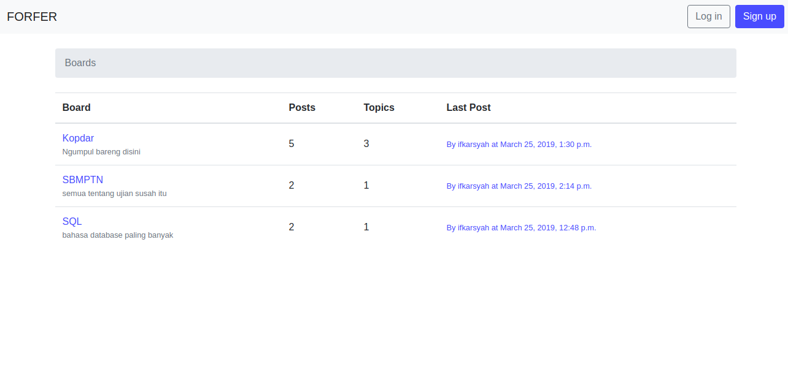
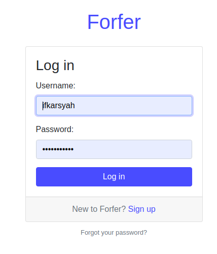
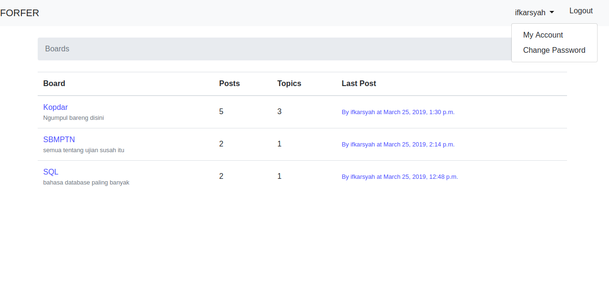
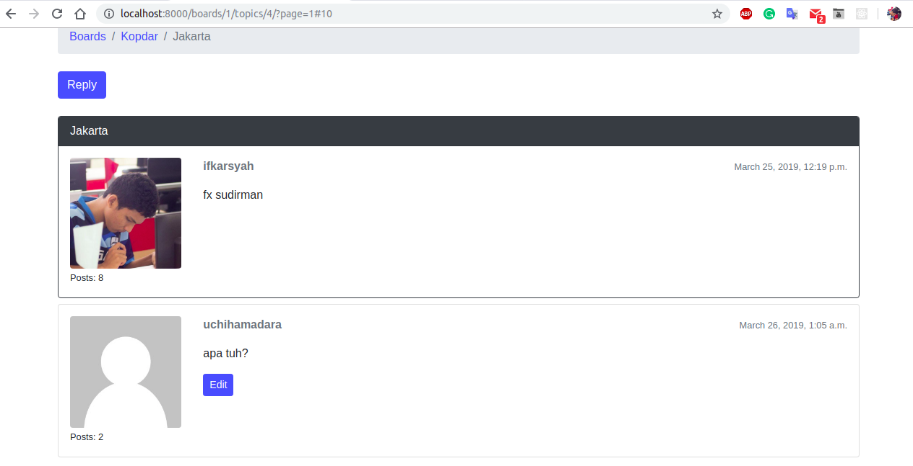

# Forfer Forum

Typical forum with basic authentication system.







## Installation

```sh
pip3 install -r requirements.txt
```

## Running

```sh
python3 manage.py runserver
```

Open your browser at [http://127.0.0.1:8000](http://127.0.0.1:8000)

## Author

Ifkarsyah – [@ifkarsyah](https://twitter.com/ifkarsyah) – ferdian.ifkarsyah@gmail.com

## License

This project is licensed under the MIT License - see the [LICENSE.md](LICENSE.md) file for details
